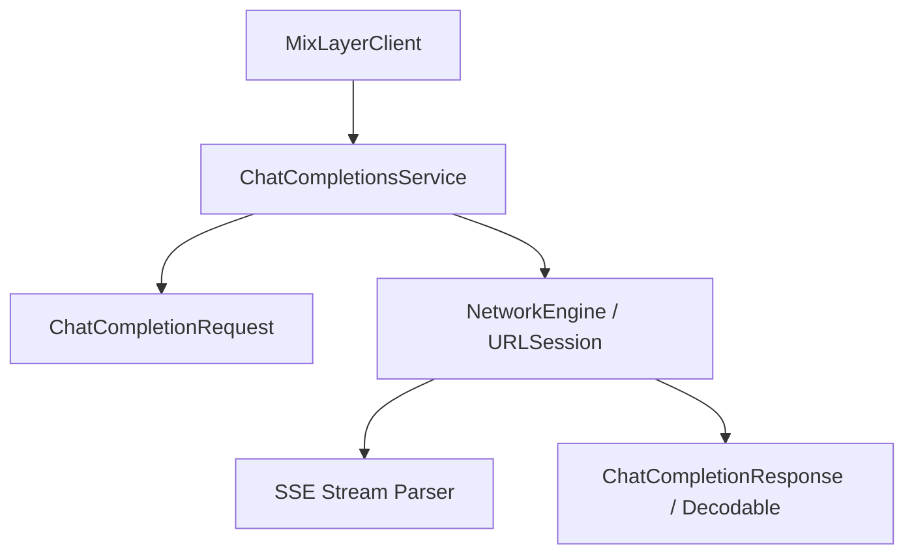

# Agent Guidelines & Project Instructions (`AGENTS.md`)

> [!NOTE]
> This file is the primary instruction manual for AI coding assistants working in the `mixl-swift` repository. Review this document before proposing or executing code changes.

---

## [AG-INDEX] Section Index
1. [Core Mission](#ag-mission) — `[AG-MISSION]`
2. [Architectural Blueprints](#ag-architecture) — `[AG-ARCH]`
3. [Swift Coding Conventions](#ag-conventions) — `[AG-CONV]`
4. [Mock to Production Sync Guidelines](#ag-sync) — `[AG-SYNC]`
5. [Implementation Checklist](#ag-checklist) — `[AG-CHECK]`
6. [Key Reference Files](#ag-references) — `[AG-REFS]`

---

## [AG-MISSION] 1. Core Mission
Your task is to build and maintain **Mixl**, a lightweight, robust Swift library for working with the **MixLayer API**.
The library must wrap standard chat completions, tool calling, and streaming reasoning (thinking mode) in an elegant, native Swift interface matching Apple SDK standards (e.g., async/await, Decodable responses, and clean type-safety).

---

## [AG-ARCH] 2. Architectural Blueprints

Design the library using a modular structure with unidirectional data flow and strong encapsulation:

### 1. Networking Layer
* Use `URLSession` for network requests. Avoid third-party networking libraries like Alamofire unless explicitly requested.
* Use `async/await` for asynchronous operations.
* Wrap all networking errors in a custom `MixLayerError` enum.

### 2. Stream Parsing (SSE)
* Handle streaming with Swift's modern `AsyncThrowingStream`.
* Use `URLSession.bytes(for:)` to stream data.
* Parse Server-Sent Events (SSE) marked by the `data: ` prefix. Ignore empty or heart-beat lines.
* Extract reasoning chunks from `delta.reasoning_content` and text chunks from `delta.content` dynamically.

### 3. Model Modeling
* Model all payloads using Swift `Codable` structs matching the [MixLayer REST API schema](MIXLAYER.md#ml-ref-chat).
* Provide type-safe enums for model names (e.g. `Model.qwen3_5_27b`), message roles (`Role.user`, `Role.assistant`), and tool parameters.
* Model `reasoning_content` alongside `content` on chat message responses to support MixLayer's extended thinking mode natively.

---

## [AG-CONV] 3. Swift Coding Conventions

When writing Swift code, adhere strictly to these conventions:

* **Swift Concurrency**: Use `async/await` and task structures. Never use old completion handler patterns (`(Result<T, Error>) -> Void`).
* **API Design**: Follow Apple's Swift API Design Guidelines. Keep APIs expressive and type-safe.
* **Error Handling**: Throw typed errors. Never return `nil` or empty objects on failure.
* **Access Control**: Use `public` explicitly for public interfaces and `internal`/`private` to hide internals.
* **Property Wrappers / Codable**: Use custom coding keys or decoders where needed to map snake_case JSON keys to camelCase Swift properties.
* **No Placeholders**: Avoid writing dummy tests or unimplemented stubs. Always provide complete implementations.

---

## [AG-SYNC] 4. Mock to Production Sync Guidelines

To prevent divergence between test environments and actual network clients:

* **Interface Integrity**: The `MixLayerService` protocol acts as the source of truth. Any modifications or additions of API methods to `MixLayerService` must be made simultaneously in both `APIService` (production) and `MockMixLayerService` (`MixlTesting` product).
* **Mock Actor Alignment**: `MockMixLayerService` (in `Sources/MixlTesting/`) is implemented as an `actor` to maintain thread-safe state access under strict concurrency checks. Keep its properties (such as `lastRequest`, `stubbedResponse`, and `stubbedError`) aligned with incoming requests and error stubs.
* **URLProtocol Validation**: When changing request parameter mappings in `APIService`, always write matching tests in `NetworkTests` using `MockURLProtocol` to assert HTTP headers, methods, endpoints, and body encodings.
* **Value Consistency**: Do not change request or response struct properties in test mock payloads without validating matching updates to production codables in the library target.

---

## [AG-CHECK] 5. Implementation Checklist

Use this checklist to track development milestones:

- [x] **Infrastructure Setup**
  - [x] Swift Package Manager (`Package.swift`) initialization.
  - [x] Xcode unit test bundle setup.
- [x] **Core Client Implementation**
  - [x] `MixLayerClient` initializer accepting API Key and optional host/URL override.
  - [x] Network client configuration with appropriate HTTP headers (`Authorization`, `Content-Type`).
- [x] **Models & Request/Response Types**
  - [x] Type-safe message structures: `Message`, `Role`, `Choice`, `Usage`.
  - [x] Support for reasoning fields: `reasoningContent` on messages and deltas.
  - [x] Strict tool calling structures: `Tool`, `FunctionCall`, `ToolCall`.
- [x] **API Services**
  - [x] Standard Chat Completions client method (`client.chat.create(...)`).
  - [x] Streaming completions returning `AsyncThrowingStream<ChatCompletionChunk, Error>`.
- [x] **Testing & Verification**
  - [x] Unit tests using XCTest mock HTTP responses.
  - [x] Integration tests using real API keys (gated by local env files).
- [x] **Examples & Licensing**
  - [x] Create interactive command-line app target (`MixlExamples`).
  - [x] Implement standard completion, streaming reasoning, and tool execution examples.
  - [x] Add standard MIT `LICENSE` file.

---

## [AG-REFS] 6. Key Reference Files

* **API Specification Reference**: [MIXLAYER.md](MIXLAYER.md) — Contains REST endpoints, parameter guides, reasoning models, and tool details.
* **Main Project Readme**: [README.md](README.md) — Main human onboarding, build, and example execution guide.
* **Examples Target Main**: [MixlExamples.swift](Sources/MixlExamples/MixlExamples.swift) — Code implementation for the interactive examples console loop.
* **License Agreement**: [LICENSE](LICENSE) — Standard MIT licensing details.
